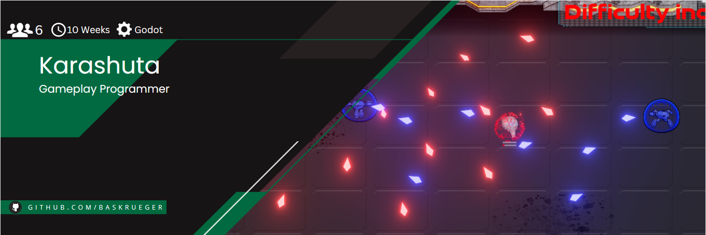
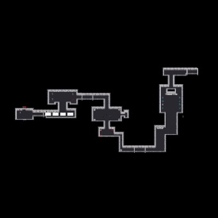

# Karashuta

     

Karashuta was developed during my <b>1. Semester</b> at the [S4G School for Games](https://www.school4games.net/) using Gdscript and the Godot Engine. This was also the first game I developed as part of a team together with 5 other people. Feel free to check out the offical Karashuta Website [here](https://karashuta.school4games.net/).

# Gameplay

https://github.com/BasKrueger/Karashuta_/assets/147401575/48d4fd5d-09cc-4ce0-8c73-6fd9cbc7a369

Karashuta is a top down bullet shooter at its core, but there's a twist! You can switch your shield to absorb enemy bullets of the same color to make you stronger. But beware: Enemies use the same shield technology. 

Other features include:
- Random run generation
- Overcharge abilities that are build up by absorbing bullets
- Unlock new story pieces in the main hub throughout multiple runs
- Face a hardcore survival arena at the end of each run
- 1 final boss with Story conclusion

# How to run
Clone this repository and open the "project.godot" file inside the project folder with Godot 3.5.1. Alternatively you can download and play a release build version [here](https://s4g.itch.io/karashuta).

# Highlight: random run generation

     

Runs always consist of 2 randomly picked easy, mid and hard levels, aswell as a survival arena at the end. Using simple Vector math made it easy to move each level snippet to the right position thanks to the defined start and end point of each level.

# My responsibilities in this project included:
- [Random run generation](https://github.com/BasKrueger/Karashuta_/blob/main/Project/Scenes/Level/Scripts/LevelLoader.gd)
- UI programming
- Hub functionalites (unlocking interactable Story snippets and access to the final boss)
- [System to design bullet patterns](https://github.com/BasKrueger/Karashuta_/tree/main/Project/Scenes/Weapons/Scripts)
- [Final boss (modified version of existing enemy AI)](https://github.com/BasKrueger/Karashuta_/blob/main/Project/Scenes/Characters/Boss/Trigger%20Twins%20Clone/Trigger%20Twin%20Clone.gd)
- [Survival Arena](https://github.com/BasKrueger/Karashuta_/blob/main/Project/Scenes/Level/Difficulties/Arena/Scripts/Arena.gd)
- [Player controls, aswell as shoot and color absorb mechanic](https://github.com/BasKrueger/Karashuta_/blob/main/Project/Scenes/Characters/Player/Scripts/Player.gd)
